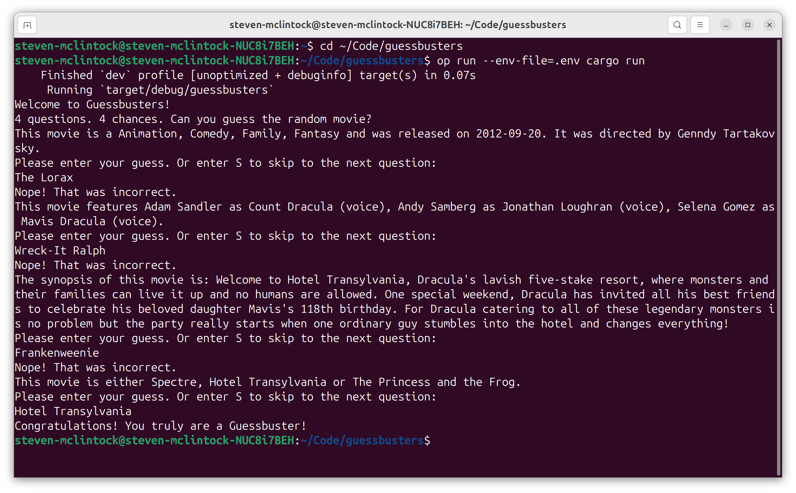
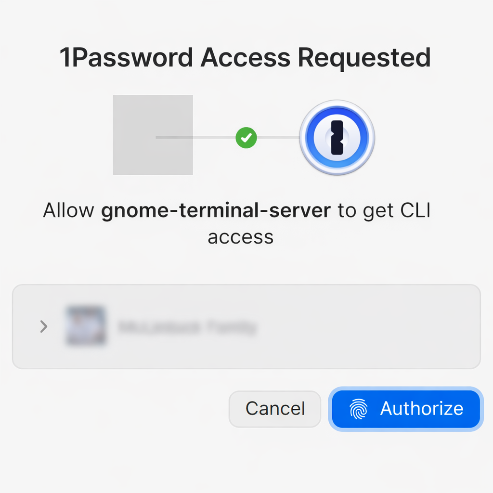

# Guessbusters

Guessbusters is a command-line trivia game that challenges you to identify random movies based on four clues. Built entirely in **Rust**, the application uses the TMDB (The Movie Database) API to fetch real movie data and generate dynamic questions. Each game presents you with four different types of clues: movie genres, cast members, plot overview, and a multiple-choice question. Can you guess the correct movie title before running out of chances?



The game is designed for quick, interactive play with questions generated on-the-fly from TMDB's extensive movie database. Whether you're a movie buff looking for a fun challenge or just want to test your cinema knowledge, Guessbusters offers an engaging way to discover (and be reminded of) films from across the entire spectrum of cinema.

## How to Run Locally



### Prerequisites
- **Rust**: Install Rust from [rustup.rs](https://rustup.rs/)
- **TMDB API Key**: Sign up for a free account at [The Movie Database](https://www.themoviedb.org/) and generate an API key

### Setup & Execution

1. **Clone the repository** and navigate to the project directory:
   ```bash
   cd guessbusters
   ```

2. **Create a `.env` file** in the project root with your TMDB API key:
   ```bash
   echo "TMDB_API_KEY=your_api_key_here" > .env
   ```

    Alternatively, if you are using the [1Password CLI](https://developer.1password.com/docs/cli/), you may run:

   ```bash
   echo "TMDB_API_KEY=op://<vault-name>/<item-name>/[section-name/]<field-name>" > .env
   ```

3. **Run the game**:
   ```bash
   cargo run
   ```

   Alternatively, if you are using the [1Password CLI](https://developer.1password.com/docs/cli/), you may run:

   ```bash
   op run --env-file=.env cargo run
   ```

The game will start immediately and display the first trivia question. Enter your guess to try to identify the movie, or type `S` to skip to the next question. Good luck!
